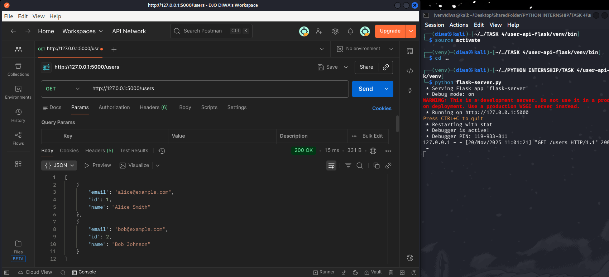
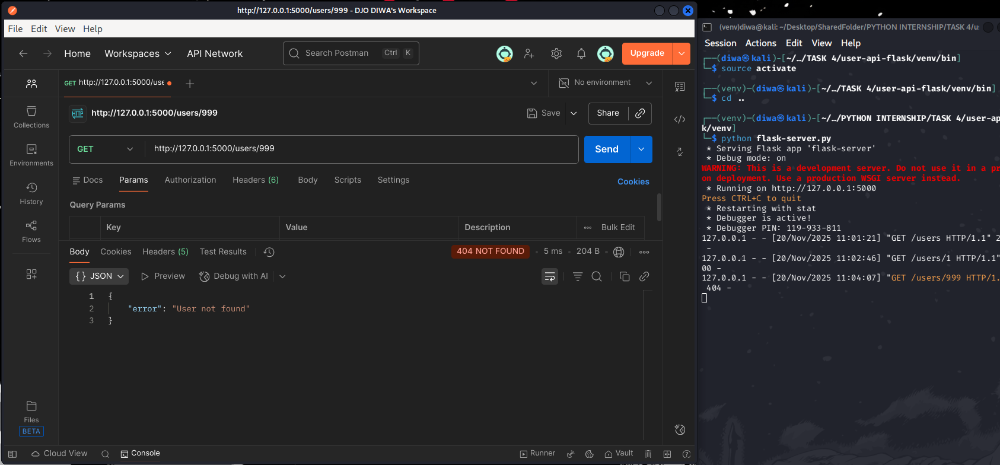
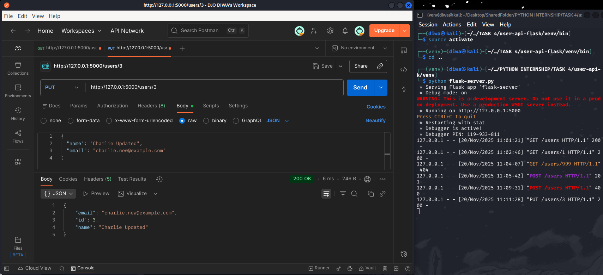
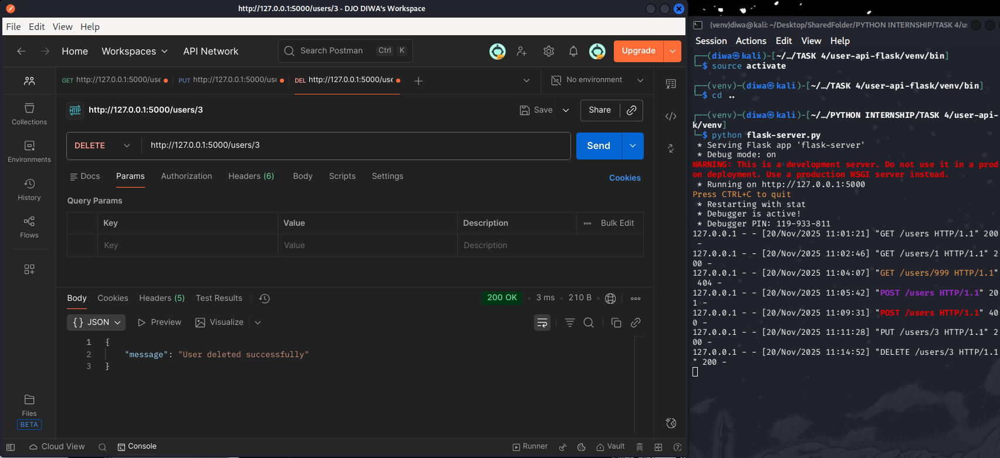
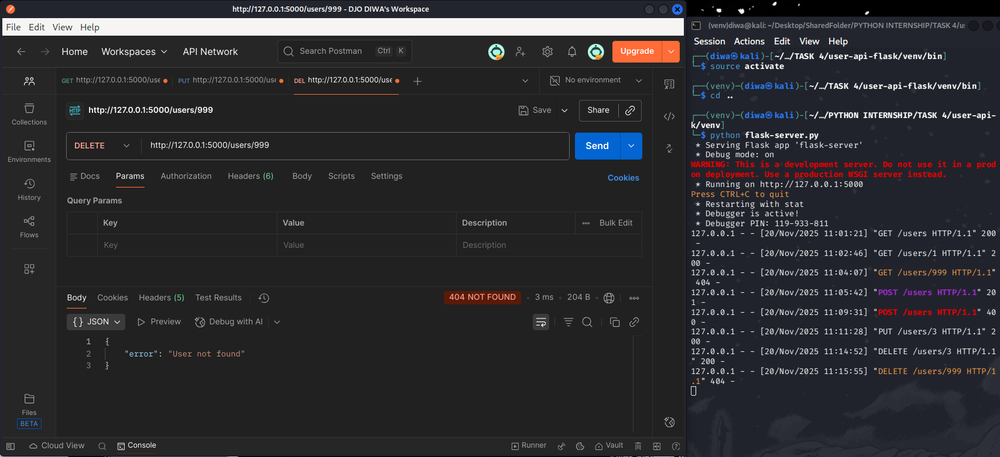

# WEB DEVELOPMENT INTERNSHIP - Task 4: Build a REST API with Flask

## Overview
This task implements a complete RESTful API using Flask for managing user data through full CRUD operations (Create, Read, Update, Delete). The API uses an in-memory Python list as storage and strictly follows REST principles with correct HTTP methods, status codes, JSON handling, input validation, and clear error messages.

## How to Run the API
1. **Create and activate virtual environment** (recommended):
   ```bash
   python -m venv flask-api-env
   source flask-api-env/bin/activate        # Linux/macOS
   # or
   flask-api-env\Scripts\activate           # Windows
   ```
2. **Install Flask**:
   ```bash
   pip install flask
   ```
3. **Save the code as `app.py`**
4. **Run the server**:
   ```bash
   python app.py
   ```
   → Server starts at: http://127.0.0.1:5000

## API Endpoints & Screenshots (Tested with Postman)

### 1. GET /users → Retrieve All Users
```bash
GET http://127.0.0.1:5000/users
```
  
*Returns the complete list of users (200 OK)*

### 2. GET /users/<id> → Retrieve Single User
```bash
GET http://127.0.0.1:5000/users/1
```
  
*Successfully retrieves user with ID 1 (200 OK)*

```bash
GET http://127.0.0.1:5000/users/999
```
  
*Returns 404 when user does not exist*

### 3. POST /users → Create New User
```bash
POST http://127.0.0.1:5000/users
Content-Type: application/json

{
  "name": "Charlie Brown",
  "email": "charlie@example.com"
}
```
  
*Creates new user with auto-generated ID (201 Created)*

```bash
POST http://127.0.0.1:5000/users
Content-Type: application/json

{
  "name": "Invalid User"
}
```
  
*Returns 400 for missing fields or duplicate email*

### 4. PUT /users/<id> → Update Existing User
```bash
PUT http://127.0.0.1:5000/users/3
Content-Type: application/json

{
  "name": "Charlie Updated",
  "email": "charlie.new@example.com"
}
```
  
*Updates user fields (200 OK)*

### 5. DELETE /users/<id> → Delete User
```bash
DELETE http://127.0.0.1:5000/users/3
```
  
*Successfully deletes the user (200 OK)*

```bash
DELETE http://127.0.0.1:5000/users/999
```
  
*Returns 404 when user not found*

## Features Implemented
- Full CRUD operations on `/users` resource
- Auto-incrementing unique user IDs
- Duplicate email prevention
- Proper HTTP status codes (200, 201, 400, 404)
- JSON request/response handling
- Input validation and descriptive errors
- In-memory persistence using Python list

## Tools Used
- Python 3.12
- Flask
- Postman (for testing and screenshots)

## Key Learnings
- REST API design and HTTP method semantics
- Flask routing, request/response handling, and JSON parsing
- Proper use of HTTP status codes
- Error handling and input validation
- API testing and documentation workflow with Postman

## Files Included
- `app.py` – The complete Flask API script
